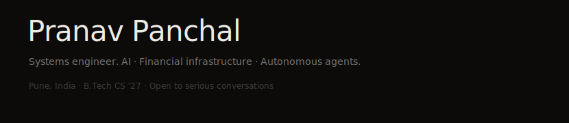

<code>STATUS</code> Shadow Credit is moving into production as a multi-agent underwriting platform that converts informal MSME financial evidence into OCEN-compliant decision packets, enabling lenders to underwrite beyond documentation-heavy credit models.

 

<code>CURRENT WORK</code>

<table border="0" cellspacing="0" cellpadding="4">
	<tr>
		<td><code>SC-AGENTBUS</code></td>
		<td>Shadow Credit runs a seven-agent service graph with schema-typed handoffs from OCR ingestion to policy memo synthesis, removing analyst reconciliation drift from the underwriting path.</td>
	</tr>
	<tr>
		<td><code>ARGUS-V2</code></td>
		<td>ARGUS PRISM operationalizes WarmthScore v2 across Neo4j account-neighborhood graphs and emits FIU-IND AutoSTR XML at runtime for investigator-ready escalation.</td>
	</tr>
	<tr>
		<td><code>OCEN-IO</code></td>
		<td>A canonical evidence layer maps passbooks, invoices, and chat-ledger artifacts into OCEN-aligned credit primitives reusable across underwriting and fraud workflows.</td>
	</tr>
	<tr>
		<td><code>SHIP-RUNWAY</code></td>
		<td>FastAPI services and Next.js 14 operator surfaces ship on a single contract version, keeping models, APIs, and decision interfaces release-consistent in production.</td>
	</tr>
</table>

 

<code>PROJECTS</code>

### [Shadow Credit](https://github.com/pranavpanchal1326/shadow-credit)
<code>Claude API · PaddleOCR · FastAPI · SQLite · Next.js 14</code>

Shadow Credit orchestrates a seven-agent pipeline where OCR ingestion, transaction reconstruction, policy reasoning, and memo synthesis run as isolated services over FastAPI contracts.
It solves the undocumented MSME underwriting bottleneck by turning fragmented informal records into lender-consumable OCEN assessments without manual spreadsheet reconstruction.
*Signal: 7 autonomous agents generate OCEN-compliant credit memos directly from WhatsApp exports, UPI traces, and Khata ledger evidence.*

### [ARGUS PRISM](https://github.com/pranavpanchal1326/argus-prism)
<code>Neo4j · XGBoost · SHAP · Python</code>

ARGUS PRISM models transaction ecosystems in Neo4j, engineers topology and behavior features, and scores entities with XGBoost while exposing SHAP-level rationale per alert.
It solves pre-crime mule detection by coupling graph context with evidence-traceable risk reasoning before fraudulent cash-out chains complete.
*Signal: WarmthScore v2 with runtime FIU-IND AutoSTR XML generation, built for Union Bank of India iDEA 2.0 (₹13L prize pool).* 

### [PropertyIQ](https://github.com/pranavpanchal1326/propertyiq)
<code>Python · Leaflet.js · React · FastAPI · PostgreSQL</code>

PropertyIQ combines geospatial intelligence, valuation comparables, and workflow APIs into a B2B due-diligence platform for banking collateral teams.
It solves collateral assessment drift by unifying locality evidence and valuation movement signals in one operational surface instead of fragmented analyst tooling.
*Signal: Production deployment of city-filtered locality intelligence with interactive Leaflet review and market-drift analysis workflows.*

### [ORBY](https://github.com/pranavpanchal1326/orby)
<code>PyQt6 · Ollama · Vosk · DeepFace · Kokoro TTS</code>

ORBY runs a local-first desktop architecture where Llama 3.2 inference, speech I/O, and persona-state orchestration execute on-device under PyQt6.
It solves privacy and latency constraints for companion AI by keeping inference, emotion detection, and voice response fully offline.
*Signal: 12-state adaptive persona FSM with zero cloud dependency on consumer hardware.*

### [VoxDub](https://github.com/pranavpanchal1326/voxdub)
<code>Whisper · Wav2Lip · NLLB · FFmpeg</code>

VoxDub assembles ASR, translation, voice generation, and lip synchronization into a deterministic multilingual media pipeline.
It solves cross-language video delivery constraints by preserving speech timing and facial articulation without manual frame-by-frame post-production.
*Signal: Frame-accurate multilingual dubbing pipeline integrating Whisper, NLLB, Wav2Lip, and FFmpeg.*

 

<code>STACK</code>

<table border="0" cellspacing="0" cellpadding="4">
	<tr>
		<td align="right">Language</td>
		<td>Python · TypeScript · JavaScript · SQL · Bash</td>
	</tr>
	<tr>
		<td align="right">AI / ML</td>
		<td>Claude API · LangChain · XGBoost · SHAP · Ollama · Whisper · PaddleOCR</td>
	</tr>
	<tr>
		<td align="right">Backend</td>
		<td>FastAPI · Flask · Node.js · SQLite · PostgreSQL</td>
	</tr>
	<tr>
		<td align="right">Frontend</td>
		<td>React · Next.js 14 · Leaflet.js · PyQt6</td>
	</tr>
	<tr>
		<td align="right">Graph</td>
		<td>Neo4j · PostgreSQL</td>
	</tr>
	<tr>
		<td align="right">Tools</td>
		<td>Git · Docker · Linux · FFmpeg · Ollama</td>
	</tr>
</table>

 

<code>STATS</code>

<table border="0" cellspacing="0" cellpadding="0">
	<tr>
		<td></td>
		<td></td>
	</tr>
</table>

 

<code>CONNECT</code>

<code>$ x         -> <a href="https://x.com/PranavP70219">@PranavP70219</a></code> 
<code>$ linkedin  -> <a href="https://linkedin.com/in/pranavpanchal1326">pranavpanchal1326</a></code> 
<code>$ github    -> <a href="https://github.com/pranavpanchal1326">pranavpanchal1326</a></code>

Pune · India · 2026
