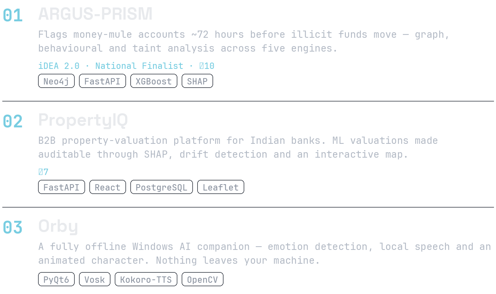
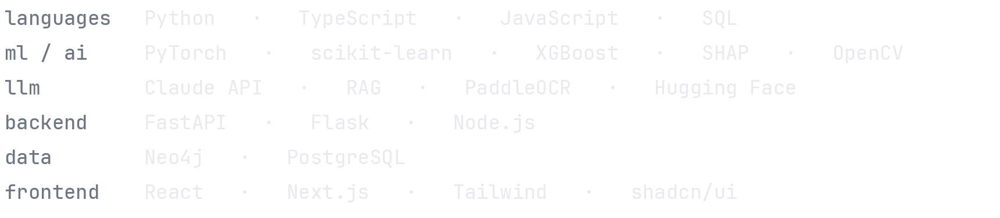

<!--
────────────────────────────────────────────────────────────
  pranav panchal · profile README
  assets: aurora.jpg · wordmark.png · knight.jpg · work.png · craft.png · void.jpg
  Section type is baked into work.png / craft.png so the fonts stay consistent.
────────────────────────────────────────────────────────────
-->

<div align="center">


<br/><br/>


<br/>

<sub>ai/ml engineer&nbsp;&nbsp;·&nbsp;&nbsp;i build production systems, not demos&nbsp;&nbsp;·&nbsp;&nbsp;pune, in</sub>

</div>

<br/>

###### ▍ ABOUT

<table border="0">
<tr>
<td width="38%" valign="top"></td>
<td width="62%" valign="top">
Final-year computer-science student building in <b>AI/ML</b> — retrieval systems, multi-agent pipelines, and models you can actually explain.
<br/><br/>
I ship complete products, not demos: I sweat the empty states, the failure paths, and the parts no one applauds but everything depends on.
</td>
</tr>
</table>

```console
$ pranav --status
→ role       ai/ml engineer · final-year cs
→ open to    internships & serious collaborators
→ stack      python · pytorch · fastapi · neo4j
→ reach      linkedin / x
```

###### ▍ SELECTED WORK



<sub>→&nbsp; open&nbsp; [ARGUS-PRISM](https://github.com/pranavpanchal1326/ARGUS-PRISM) &nbsp;·&nbsp; [PropertyIQ](https://github.com/pranavpanchal1326/PropertyIQ) &nbsp;·&nbsp; [Orby](https://github.com/pranavpanchal1326/orby)</sub>

###### ▍ CRAFT



###### ▍ RECOGNITION

<sub>
◦&nbsp; <b>iDEA 2.0</b> (Union Bank of India) — national finalist, ARGUS-PRISM<br/>
◦&nbsp; Orchestron 2026 · Agentic AI &nbsp;&&nbsp; NAV-उन्मेष 2026 · startup pitch<br/>
◦&nbsp; AWS &amp; Replit hackathons — Sarkaar Saathi, Legacy
</sub>

<br/>

<div align="center">


<br/><br/>

<sub>[ LinkedIn ](https://linkedin.com/in/pranavpanchal1326)&nbsp;&nbsp;·&nbsp;&nbsp;[ X ](https://x.com/PranavP70219)&nbsp;&nbsp;·&nbsp;&nbsp;[ Portfolio ](https://pranav-portfollio.web.app)</sub>

<br/>

<i>fabricando fit faber.</i><br/>
<sub>by making, one becomes the maker.</sub>

</div>
