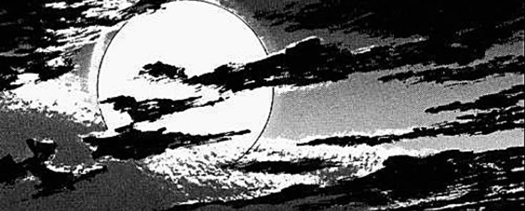
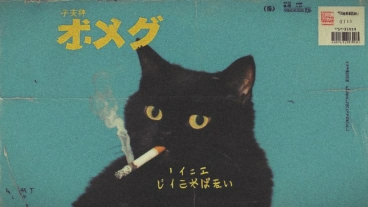
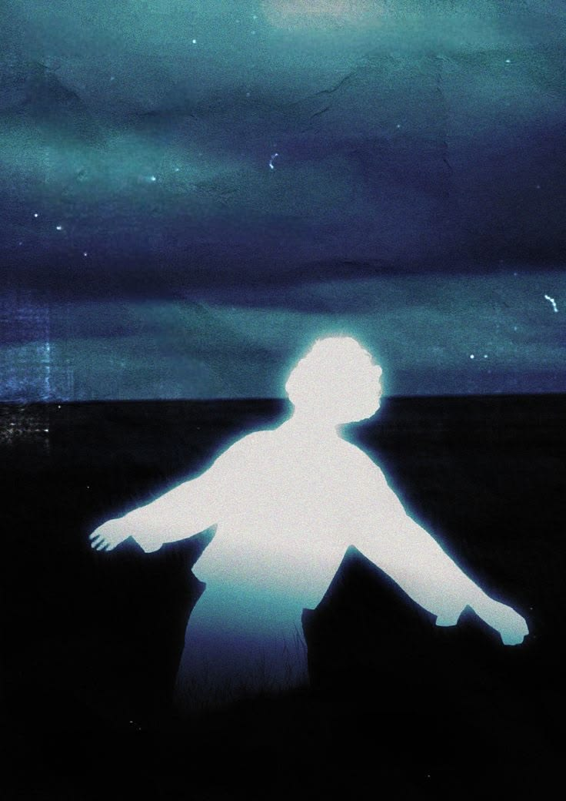
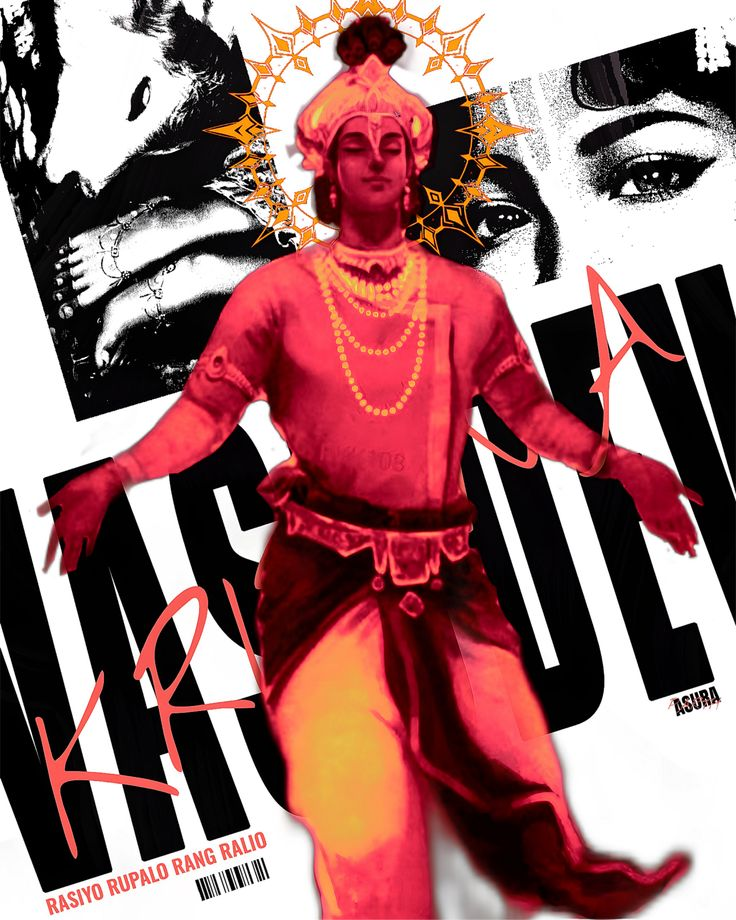
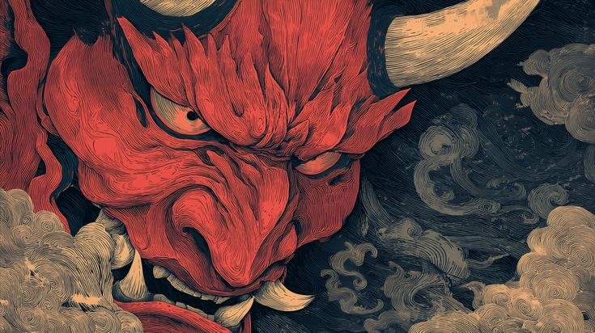
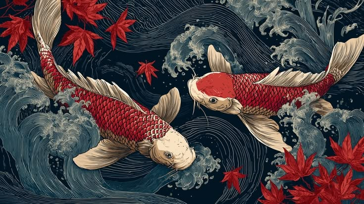

<!--
──────────────────────────────────────────────────────────────────────
  pranav panchal · profile readme
  concept — "THE LONG NIGHT"

  every image kept here is the same picture: a lone figure, in the dark,
  unwatched. the page is built as a single night — five numbered
  chapters running 22:40 to 06:04, dusk to dawn. the tension between
  painterly art and terminal typography is the design.

  the banner keeps time with the reader, and the arc closes on itself:
      dark mode   moon.jpg      night
      light mode  blossom.jpg   dawn

  GRID — every division on the page is a twelfth. nothing is eyeballed.
      5 / 7          about          42 / 58
      8 / 4          status         67 / 33
      1 / 3 / 6 / 2  work index     8 / 25 / 50 / 17
      4 / 4 / 4      triptych       33 / 33 / 33
      6 / 6          craft          50 / 50
      4 / 8          recognition    33 / 67
      8              coda           67 centred

  TYPE — no image is used to render text. all of it is real,
  selectable, searchable, screen-readable.
      masthead    h1, under a hairline rule
      eyebrow     mono coordinates
      chapter     h6 + mono, label left, timestamp right
      work        index row — number left, meta right. same component
                  language as the chapter rule, one level down.
      data        yaml / console fences, syntax colour is free palette
      caption     sub
      links       kbd, renders as physical key caps

  GLYPHS — one job each, never mixed. no emoji anywhere on the page.
      ▍  chapter mark      ·  separator
      →  action / link     ◦  list bullet

  TRIPTYCH — ordered by height, tallest to shortest, so the ragged
  bottom edge becomes a deliberate descending stair. asura sits last:
  shortest plate, and the only bright one, so the row lands on an
  accent instead of drifting.

  COPY — every project line and every craft entry is taken from the
  repositories themselves. nothing here is invented.

  IN USE    moon · blossom · knight · cat · silhouette · passage ·
            asura · oni · koi · icarus · void
  RETIRED   aurora.jpg     palette fights every other image
            lotus.jpg      burnt-in subtitles, it is a video screengrab
            wordmark.png   white-on-transparent, invisible to anyone
                           on light mode. replaced by real text.
──────────────────────────────────────────────────────────────────────
-->

<div align="center">

<picture>
  <source media="(prefers-color-scheme: dark)"  srcset="assets/moon.jpg" />
  <source media="(prefers-color-scheme: light)" srcset="assets/blossom.jpg" />
  
</picture>

<br/><br/><br/>

<sub><code>18.5204&deg; N &nbsp; 73.8567&deg; E</code></sub>

<h1>PRANAV PANCHAL</h1>

</div>

<hr/>

<div align="center">

<sub><code>AI/ML ENGINEER</code>&nbsp;&nbsp;·&nbsp;&nbsp;<code>PUNE, IN</code>&nbsp;&nbsp;·&nbsp;&nbsp;<code>FINAL-YEAR CS</code></sub>

<br/><br/>

<sub><i>i build production systems, not demos.</i></sub>

</div>

<br/><br/>

<table border="0" width="100%">
<tr>
<td align="left" width="50%"><h6><code>01</code>&nbsp;&nbsp;▍&nbsp;&nbsp;ABOUT</h6></td>
<td align="right" width="50%"><h6><code>22:40</code></h6></td>
</tr>
</table>

<table border="0">
<tr>
<td width="42%" valign="top">

</td>
<td width="58%" valign="top">
<br/>
Final-year computer-science student building in <b>AI/ML</b> — retrieval systems, multi-agent pipelines, and models you can actually explain.
<br/><br/>
I ship complete products, not demos. I sweat the empty states, the failure paths, and the parts no one applauds but everything depends on.
<br/><br/>
<sub>Most of it happens at night, alone, and nobody watches it happen. That is the job.</sub>
</td>
</tr>
</table>

<table border="0">
<tr>
<td width="67%" valign="top">

```console
$ pranav --status
→ role       ai/ml engineer · final-year cs
→ open to    internships & serious collaborators
→ stack      python · pytorch · fastapi · neo4j
→ hours      late
→ reach      linkedin / x
```

</td>
<td width="33%" valign="top">

</td>
</tr>
</table>

<br/><br/>

<table border="0" width="100%">
<tr>
<td align="left" width="50%"><h6><code>02</code>&nbsp;&nbsp;▍&nbsp;&nbsp;SELECTED WORK</h6></td>
<td align="right" width="50%"><h6><code>00:15</code></h6></td>
</tr>
</table>

<table border="0" width="100%">

<tr>
<td width="8%" valign="top"><sub><code>001</code></sub></td>
<td width="25%" valign="top">
<b>ARGUS&#8209;PRISM</b><br/>
<sub><code>python</code></sub>
</td>
<td width="50%" valign="top">
<sub>Mule-account detection and anti-money-laundering intelligence for retail banking.</sub>
</td>
<td width="17%" valign="top" align="right">
<sub><a href="https://github.com/pranavpanchal1326/ARGUS-PRISM">repository&nbsp; →</a></sub>
</td>
</tr>

<tr>
<td valign="top"><sub><code>002</code></sub></td>
<td valign="top">
<b>Nemesis</b><br/>
<sub><code>python</code></sub>
</td>
<td valign="top">
<sub>Civic-ops agent that turns citizen infrastructure reports into verified, severity-scored work orders, then proves they were fixed.</sub>
</td>
<td valign="top" align="right">
<sub><a href="https://github.com/pranavpanchal1326/Nemesis">repository&nbsp; →</a></sub>
</td>
</tr>

<tr>
<td valign="top"><sub><code>003</code></sub></td>
<td valign="top">
<b>Sarkaar Saathi</b><br/>
<sub><code>python</code></sub>
</td>
<td valign="top">
<sub>Entitlements agent for India. Listens in Hindi, Marathi or Hinglish, and cites the clause of the government order that proves the claim.</sub>
</td>
<td valign="top" align="right">
<sub><a href="https://github.com/pranavpanchal1326/Sarkaar-sathi">repository&nbsp; →</a></sub>
</td>
</tr>

<tr>
<td valign="top"><sub><code>004</code></sub></td>
<td valign="top">
<b>Orby</b><br/>
<sub><code>python</code></sub>
</td>
<td valign="top">
<sub>Offline desktop companion for Windows. Sees context, hears voice, remembers patterns, and starts conversations on its own.</sub>
</td>
<td valign="top" align="right">
<sub><a href="https://github.com/pranavpanchal1326/orby">repository&nbsp; →</a></sub>
</td>
</tr>

</table>

<br/><br/>

<table border="0" width="100%">
<tr>
<td align="left" width="50%"><h6><code>03</code>&nbsp;&nbsp;▍&nbsp;&nbsp;THE LONG NIGHT</h6></td>
<td align="right" width="50%"><h6><code>02:30</code></h6></td>
</tr>
</table>

<table border="0">
<tr>
<td width="33%" valign="top"></td>
<td width="33%" valign="top"></td>
<td width="33%" valign="top"></td>
</tr>
</table>

<div align="center">
<sub>alone&nbsp;&nbsp;→&nbsp;&nbsp;moving through&nbsp;&nbsp;→&nbsp;&nbsp;lit up</sub>
</div>

<br/><br/>

<table border="0" width="100%">
<tr>
<td align="left" width="50%"><h6><code>04</code>&nbsp;&nbsp;▍&nbsp;&nbsp;CRAFT</h6></td>
<td align="right" width="50%"><h6><code>03:50</code></h6></td>
</tr>
</table>

<table border="0">
<tr>
<td width="50%" valign="top"></td>
<td width="50%" valign="top"></td>
</tr>
</table>

```yaml
languages:   python  ·  javascript
ml:          pytorch  ·  xgboost  ·  opencv  ·  local llms
serving:     fastapi
streaming:   kafka  ·  flink
graph:       neo4j
interface:   react  ·  pyqt6
```

<br/><br/>

<table border="0" width="100%">
<tr>
<td align="left" width="50%"><h6><code>05</code>&nbsp;&nbsp;▍&nbsp;&nbsp;RECOGNITION</h6></td>
<td align="right" width="50%"><h6><code>05:10</code></h6></td>
</tr>
</table>

<table border="0">
<tr>
<td width="33%" valign="top">

</td>
<td width="67%" valign="top">
<br/>
<sub>
◦&nbsp; <b>iDEA 2.0</b> (Union Bank of India) — national finalist, ARGUS-PRISM
<br/><br/>
◦&nbsp; <b>Orchestron 2026</b> · Agentic AI
<br/><br/>
◦&nbsp; <b>NAV-उन्मेष 2026</b> · startup pitch
<br/><br/>
◦&nbsp; <b>AWS &amp; Replit</b> hackathons — Sarkaar Saathi, Legacy
</sub>
<br/><br/>
<sub><i>fly close enough to feel it.</i></sub>
</td>
</tr>
</table>

<br/><br/>

<table border="0" width="100%">
<tr>
<td align="left" width="50%"><h6><code>—</code>&nbsp;&nbsp;▍&nbsp;&nbsp;DAWN</h6></td>
<td align="right" width="50%"><h6><code>06:04</code></h6></td>
</tr>
</table>

<div align="center">


<br/><br/><br/>

<a href="https://linkedin.com/in/pranavpanchal1326"><kbd>&nbsp; LINKEDIN &nbsp;</kbd></a>
&nbsp;&nbsp;
<a href="https://x.com/PranavP70219"><kbd>&nbsp; X &nbsp;</kbd></a>
&nbsp;&nbsp;
<a href="https://pranav-portfollio.web.app"><kbd>&nbsp; PORTFOLIO &nbsp;</kbd></a>

<br/><br/><br/>

<i>fabricando fit faber.</i><br/>
<sub>by making, one becomes the maker.</sub>

</div>
