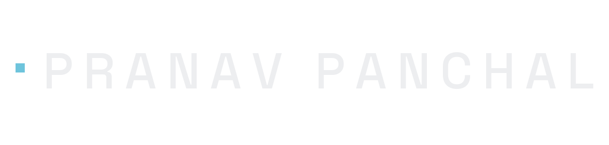
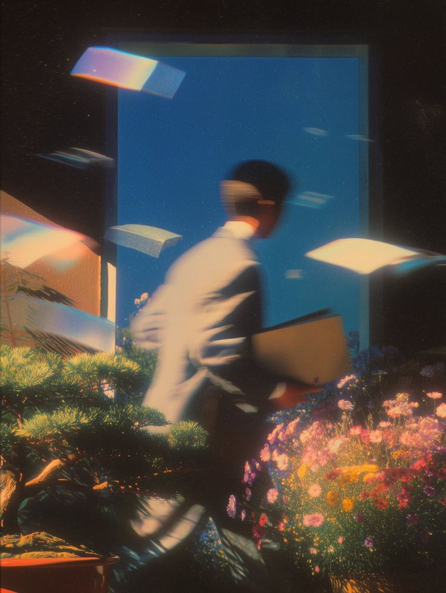

<!--
────────────────────────────────────────────────────────────
  pranav panchal · profile README
  assets: aurora.jpg · wordmark.png · knight.jpg · passage.jpg · icarus.jpg
  Quote is the live github-readme-quotes widget (rotates on load).
────────────────────────────────────────────────────────────
-->

  

 

A I / M L&nbsp;&nbsp;E N G I N E E R &nbsp;·&nbsp; P R O D U C T I O N&nbsp;&nbsp;S Y S T E M S ,&nbsp;&nbsp;N O T&nbsp;&nbsp;D E M O S &nbsp;·&nbsp; P U N E ,&nbsp;&nbsp;I N

 

---

<b>✦&nbsp;&nbsp;&nbsp;T H E&nbsp;&nbsp;P E R S O N&nbsp;&nbsp;&nbsp;✦</b>

 

<table>
<tr>
<td width="64%" valign="top">

Final-year computer-science student at **DES Pune University** who got tired of building things that only work in a demo.

I don't write code to pass a viva. I write it to ship systems that hold up under real users — fraud detection that catches mules before money moves, an entitlements engine that cites the government order it decided from, a municipal platform that produces evidence instead of status updates.

My stack is whatever the problem needs. Lately that's **Python · FastAPI · Neo4j · PyTorch**, with a lot of ML glue holding it together.

I move slowly on the things that matter and fast on the things that don't — building toward a company of my own, in public, one shipped product at a time.

</td>
<td width="36%" valign="top">

</td>
</tr>
</table>

---

<b>✦&nbsp;&nbsp;&nbsp;T H E&nbsp;&nbsp;M I S S I O N&nbsp;&nbsp;&nbsp;✦</b>

 

> **The goal is a technology company — not a portfolio of demos.**
>
> Tools developers reach for. Products people pay for. Systems that keep standing once I step away from the keyboard.
>
> *Still a student. Still early. Shipping in public until the work speaks for itself.*

---

<b>✦&nbsp;&nbsp;&nbsp;W H A T&nbsp;&nbsp;I ' M&nbsp;&nbsp;B U I L D I N G&nbsp;&nbsp;&nbsp;✦</b>

 

 

<table>
<tr>
<td width="50%" valign="top">
<h3>ARGUS-PRISM</h3>

<b><i>The pre-crime alarm banks don't have.</i></b>

Flags money-mule accounts <b>~72h before</b> illicit funds move — fusing FlowGraph, behavioural WarmthScore signals and taint propagation across five engines.

<code>Neo4j</code>&nbsp; <code>FastAPI</code>&nbsp; <code>XGBoost</code>&nbsp; <code>SHAP</code>

<a href="https://github.com/pranavpanchal1326/ARGUS-PRISM">→ Repository</a>&nbsp;&nbsp;·&nbsp;&nbsp;<i>iDEA 2.0 · National Finalist</i>

</td>
<td width="50%" valign="top">
<h3>Sarkaar Saathi</h3>

<b><i>Find what the government owes you — proven from the order, never guessed.</i></b>

An autonomous entitlements agent for India. It listens in Hindi, Marathi or Hinglish, decides with a deterministic rules engine, and shows the clause of the actual government order that says so.

<code>FastAPI</code>&nbsp; <code>React 19</code>&nbsp; <code>TypeScript</code>&nbsp; <code>JSON-Logic</code>

<a href="https://github.com/pranavpanchal1326/Sarkaar-sathi">→ Repository</a>

</td>
</tr>
<tr>
<td width="50%" valign="top">
<h3>NEMESIS</h3>

<b><i>The system that remembers.</i></b>

A municipal accountability platform built on one premise: a civic system earns trust by producing evidence, not status updates. Every figure is computed from an append-only event log.

<code>FastAPI</code>&nbsp; <code>PostgreSQL</code>&nbsp; <code>Celery</code>&nbsp; <code>Next.js</code>&nbsp; <code>Three.js</code>

<a href="https://github.com/pranavpanchal1326/Nemesis">→ Repository</a>

</td>
<td width="50%" valign="top">
<h3>The next one&nbsp;&nbsp;<code>coming soon</code></h3>

<b><i>Something's brewing.</i></b>

A project that isn't public yet — because it isn't ready to be. Built quietly now; it ships the day it's undeniable.

<i>Stay tuned. Or don't. Either way it'll land.</i>

</td>
</tr>
</table>

---

<b>✦&nbsp;&nbsp;&nbsp;T H E&nbsp;&nbsp;S T A C K&nbsp;&nbsp;&nbsp;✦</b>

 

 

<table>
<tr>
<td width="33%" valign="top">

<b>L A N G U A G E S</b>

<code>Python</code> <code>TypeScript</code> <code>JavaScript</code> <code>SQL</code>

</td>
<td width="33%" valign="top">

<b>M L&nbsp;&nbsp;/&nbsp;&nbsp;A I</b>

<code>PyTorch</code> <code>scikit-learn</code> <code>XGBoost</code> <code>SHAP</code> <code>OpenCV</code>

</td>
<td width="34%" valign="top">

<b>L L M</b>

<code>Claude API</code> <code>RAG</code> <code>PaddleOCR</code> <code>Hugging Face</code>

</td>
</tr>
<tr>
<td width="33%" valign="top">

<b>B A C K E N D</b>

<code>FastAPI</code> <code>Flask</code> <code>Node.js</code> <code>Celery</code>

</td>
<td width="33%" valign="top">

<b>D A T A</b>

<code>Neo4j</code> <code>PostgreSQL</code>

</td>
<td width="34%" valign="top">

<b>F R O N T E N D</b>

<code>React</code> <code>Next.js</code> <code>Tailwind</code> <code>shadcn/ui</code>

</td>
</tr>
</table>

---

<b>✦&nbsp;&nbsp;&nbsp;L E T ' S&nbsp;&nbsp;T A L K&nbsp;&nbsp;&nbsp;✦</b>

 

<table>
<tr>
<td width="50%" valign="top">

<b>O P E N&nbsp;&nbsp;T O</b>

AI/ML internships, collaborations, and conversations with people building something genuinely hard.

<b>E S P E C I A L L Y&nbsp;&nbsp;I F&nbsp;&nbsp;Y O U&nbsp;&nbsp;W O R K&nbsp;&nbsp;O N</b>

Fraud &amp; risk ML&nbsp;&nbsp;·&nbsp;&nbsp;applied AI&nbsp;&nbsp;·&nbsp;&nbsp;developer tooling&nbsp;&nbsp;·&nbsp;&nbsp;civic technology

</td>
<td width="50%" valign="top">

<b>W H A T&nbsp;&nbsp;Y O U&nbsp;&nbsp;G E T</b>

Someone who ships complete products and sweats the details — from the data model to the last pixel.

<b>R E A C H&nbsp;&nbsp;M E&nbsp;&nbsp;A T</b>

 

</td>
</tr>
</table>

---

 

