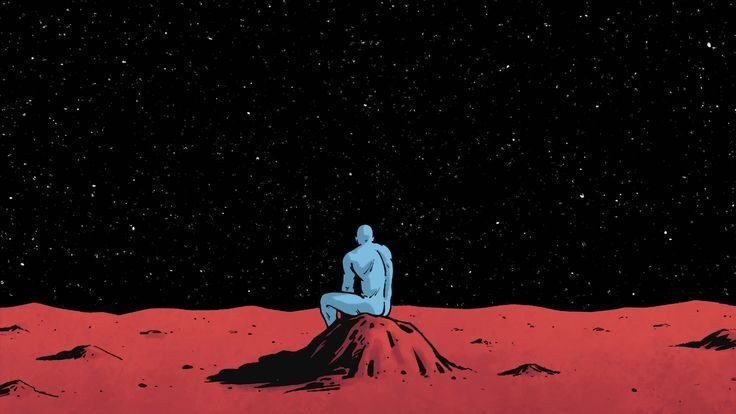

<!--
────────────────────────────────────────────────────────────
  pranav panchal · profile README
  assets: aurora.jpg · wordmark.png · knight.jpg · void.jpg
  Quote is the live github-readme-quotes widget (rotates on load).
────────────────────────────────────────────────────────────
-->

 

ai/ml engineer&nbsp;&nbsp;·&nbsp;&nbsp;i build production systems, not demos&nbsp;&nbsp;·&nbsp;&nbsp;pune, in

 

---

 ✦&nbsp;&nbsp; <b>T H E&nbsp;&nbsp;P E R S O N</b> &nbsp;✦ 

 

<table>
<tr>
<td valign="top">

&nbsp;

Final-year computer-science student at **DES Pune University** who got tired of building things that only work in a demo.

I don't write code to pass a viva. I write it to ship systems that hold up under real users — fraud detection that catches mules before money moves, valuation models a bank can actually audit, an AI companion that runs with no cloud behind it.

My stack is whatever the problem needs. Lately that's **Python · FastAPI · Neo4j · PyTorch**, with a lot of ML glue holding it together.

I move slowly on the things that matter and fast on the things that don't — building toward a company of my own, in public, one shipped product at a time.

&nbsp;

</td>
<td width="34%" valign="top">

</td>
</tr>
</table>

---

 ✦&nbsp;&nbsp; <b>T H E&nbsp;&nbsp;M I S S I O N</b> &nbsp;✦ 

 

> **The goal is a technology company — not a portfolio of demos.**
>
> Tools developers reach for. Products people pay for. Systems that keep standing once I step away from the keyboard.
>
> *Still a student. Still early. Shipping in public until the work speaks for itself.*

---

 ✦&nbsp;&nbsp; <b>W H A T&nbsp;&nbsp;I ' M&nbsp;&nbsp;B U I L D I N G</b> &nbsp;✦ 

 

<table>
<tr>
<td width="50%" valign="top">

&nbsp;

### 🛡️ &nbsp;ARGUS-PRISM

The pre-crime alarm banks don't have.

Flags money-mule accounts **~72h before** illicit funds move — fusing FlowGraph, behavioural WarmthScore signals and taint propagation across five engines.

`Neo4j` &nbsp;`FastAPI` &nbsp;`XGBoost` &nbsp;`SHAP`

→ [Repository](https://github.com/pranavpanchal1326/ARGUS-PRISM) &nbsp; · &nbsp; *iDEA 2.0 · National Finalist*

&nbsp;

</td>
<td width="50%" valign="top">

&nbsp;

### 🏦 &nbsp;PropertyIQ

Property valuation a bank can actually audit.

A B2B platform pairing ML valuations with SHAP explainability, drift detection and an interactive map — built for Indian lenders.

`FastAPI` &nbsp;`React` &nbsp;`PostgreSQL` &nbsp;`Leaflet`

→ [Repository](https://github.com/pranavpanchal1326/PropertyIQ)

&nbsp;

</td>
</tr>
<tr>
<td width="50%" valign="top">

&nbsp;

### 🤖 &nbsp;Orby

An AI companion that never phones home.

A fully offline Windows desktop companion — emotion detection, local speech, and an animated character. No cloud; nothing leaves your machine.

`PyQt6` &nbsp;`Vosk` &nbsp;`Kokoro-TTS` &nbsp;`OpenCV`

→ [Repository](https://github.com/pranavpanchal1326/orby)

&nbsp;

</td>
<td width="50%" valign="top">

&nbsp;

### 🌒 &nbsp;The next one &nbsp; `coming soon`

Something's brewing.

A project that isn't public yet — because it isn't ready to be. Built quietly now; it ships the day it's undeniable.

*Stay tuned. Or don't. Either way it'll land.*

&nbsp;

</td>
</tr>
</table>

---

 ✦&nbsp;&nbsp; <b>T H E&nbsp;&nbsp;S T A C K</b> &nbsp;✦ 

 

<table>
<tr>
<td width="46%" valign="middle">

</td>
<td width="54%" valign="middle">

&nbsp;

<b>Languages</b> 
<code>Python</code> <code>TypeScript</code> <code>JavaScript</code> <code>SQL</code>
  
<b>ML / AI</b> 
<code>PyTorch</code> <code>scikit-learn</code> <code>XGBoost</code> <code>SHAP</code> <code>OpenCV</code>
  
<b>LLM</b> 
<code>Claude API</code> <code>RAG</code> <code>PaddleOCR</code> <code>Hugging Face</code>
  
<b>Backend</b> 
<code>FastAPI</code> <code>Flask</code> <code>Node.js</code>
  
<b>Data</b> 
<code>Neo4j</code> <code>PostgreSQL</code>
  
<b>Frontend</b> 
<code>React</code> <code>Next.js</code> <code>Tailwind</code> <code>shadcn/ui</code>

&nbsp;

</td>
</tr>
</table>

---

✦&nbsp;&nbsp; <b>L E T ' S&nbsp;&nbsp;T A L K</b> &nbsp;✦

  

I'm open to <b>AI/ML internships, collaborations, and conversations</b> with people building something genuinely hard.

If you're working on fraud &amp; risk ML, applied AI, or developer tooling — I want to hear about it.

If you need someone who ships complete products and sweats the details — reach out.

 

&nbsp;

&nbsp;

&nbsp;

---

 

